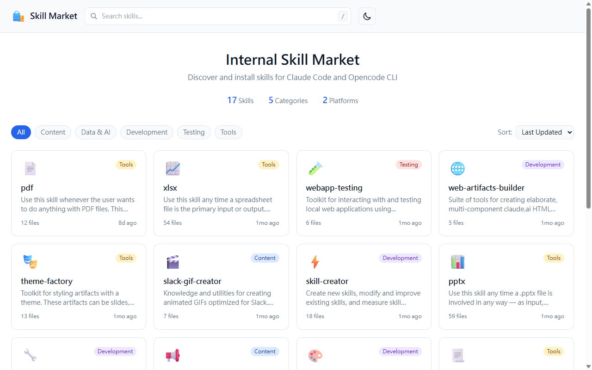
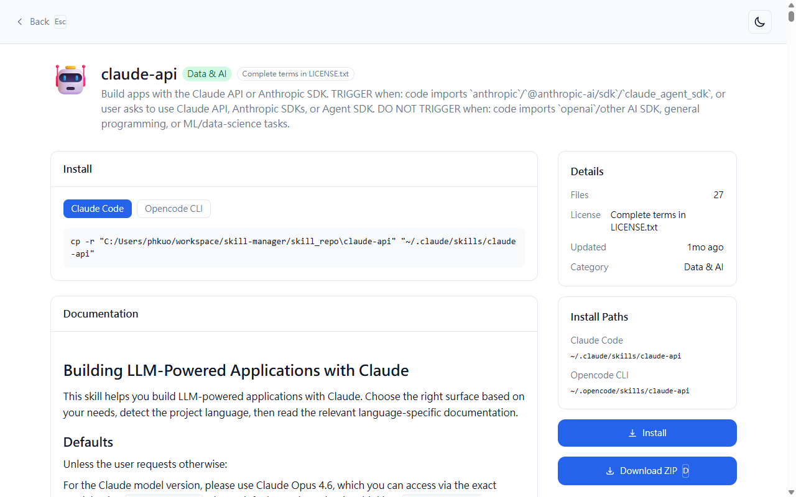

# Skill Market

A self-hosted web app for browsing, searching, and installing Claude Code /
Opencode CLI skills from a local skill repository. Designed for internal-network
deployment.




## Features

- Browse skills with real-time search and category filters
- Server-rendered install commands and per-skill ZIP download
- Dark / light theme (auto-detects system preference)
- Live reload — drop a new skill into `skill_repo/` and the catalog updates
  without a restart (filesystem watcher with 300 ms debounce)
- Keyboard shortcuts: `/` or `Ctrl+K` to focus search, `Esc` to clear or to
  return to the catalog from a detail page, `D` to download the current skill

## Stack

- **Backend:** Django 5.x (Django 4.x on Python 3.8/3.9), single app `skills`
- **Frontend:** static HTML + vanilla JS in `frontend/`, vendored Tailwind /
  marked / highlight.js (no bundler, no build step)
- **Storage:** none — the catalog is an in-memory dict refreshed by a
  `watchdog` observer over `SKILL_REPO_PATH`. SQLite is configured to
  `:memory:` only to satisfy Django.
- **Process manager (prod):** PM2 + gunicorn

## Quick Start

```bash
git clone <repo-url>
cd skill-manager

# Create venv and install deps. start.sh picks the requirements file based
# on your Python version (3.12+ / 3.10–3.11 / 3.8–3.9).
python3 -m venv backend/venv
backend/venv/bin/pip install -r backend/requirements-dev.txt   # includes pytest
# or backend/requirements.txt for prod-only

# Run dev server (Django runserver on :3000)
./start.sh

# Run prod server (gunicorn, DEBUG=False)
./start.sh prod
```

Open <http://localhost:3000>.

## Tests

From `backend/` with the venv active:

```bash
pytest                                       # all unit tests
pytest skills/tests/test_parser.py           # one file
pytest skills/tests/test_parser.py::test_x   # one test
pytest e2e/                                  # Playwright E2E
```

E2E uses Playwright's bundled Chromium by default. Override with
`CHROMIUM_EXEC=/path/to/chrome` if you want a specific binary.

## Adding Skills

Drop a folder containing a `SKILL.md` into `skill_repo/`. The watcher picks it
up live — no restart needed.

```
skill_repo/
└── my-skill/
    ├── SKILL.md       # required — frontmatter: name, description, license,
    │                  # optional category and icon
    └── ...            # any other files
```

### Versioning

Subdirectories matching `yyyymmdd-<suffix>` that contain their own `SKILL.md`
are treated as versions. The newest by date becomes the active content; the
top-level directory is exposed as the synthetic `original` version.

```
skill_repo/
└── my-skill/
    ├── SKILL.md
    └── 20260331-rewrite/
        └── SKILL.md
```

## Environment Variables

| Variable           | Default                | Purpose                              |
|--------------------|------------------------|--------------------------------------|
| `PORT`             | `3000`                 | HTTP port                            |
| `SKILL_REPO_PATH`  | `<repo>/skill_repo`    | Source-of-truth catalog directory    |
| `CHROMIUM_EXEC`    | (Playwright default)   | E2E Chromium binary override         |

Templates live in `.env.example`, `.env.development.example`, and
`.env.production.example`.

## Production with PM2

```bash
pm2 start ecosystem.config.cjs --env production
pm2 save       # persist the process list
pm2 startup    # auto-start on system reboot

pm2 list
pm2 logs skill-market
pm2 restart skill-market
```

## Repository Layout

```
backend/
  manage.py
  skill_market/        # Django settings / urls
  skills/              # the only Django app
    parser.py          # SKILL.md → dict
    watcher.py         # filesystem observer + in-memory catalog
    classifier.py      # category / icon resolution
    file_reader.py     # detail-page recursive text walk
    zipper.py          # in-memory ZIP builder
    views.py           # HTML shells + JSON API
    tests/             # pytest unit tests
  e2e/                 # Playwright tests
frontend/              # static HTML + vanilla JS, served by WhiteNoise
skill_repo/            # the catalog (gitignored in production)
docs/
  archive/             # original Node/React-era plan.md and spec.md
```

See `CLAUDE.md` for an architecture deep-dive and conventions
(`APPEND_SLASH = False`, the `RUN_MAIN` watcher guard, etc.).
